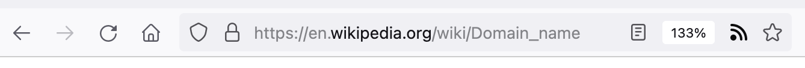

<a class="action-link" href="#send-email">Send someone here</a>

# Your website or application sends people external payment links over email. This is a serious problem you should fix quickly.

## Why was I sent here?

This link was most likely given to you by a user of your website, who noticed **a serious security problem**.

It might look something like this:

<pre>
From: bills@ocp.usa
Subject: Your monthly payment

Dear Jane Doe,

Thank you for your continued use of Omni Consumer Products. You can pay your bill by clicking the following link 

https://www.pay.easy/payment?id=JaneDoe

This will send you to the EasyPay platform, which handles payment for us.

With kind regards,
The OCP Web Team
</pre>

Maybe it's not a payment link, but some other sensitive operation. Most likely, the link is replaced by a friendly and colorful button.

The key here is that **you are emailing your user a link to a website that is not hosted by you**. And you're asking them to do something serious and sensitive on that website, like transferring money.  

Your user is trying to tell you that this is a _very_ serious security problem, and that you should fix it.

## What's the problem?

The main problem is to do with _identity_: to be safe on the internet, *people need to know who they're talking to*.

There are many scammers and phishers out there, and when your user gets a request to pay, they need to be sure the request came from _you_, and not from somebody trying to take their money. 

**Email does not establish identity.** Anybody can send an email that looks like it comes from your company. This is very easy. It does not require any hacking skills or in-depth knowledge. This is why emails, while convenient should never be trusted fully.

**Websites _can_ establish identity.** Luckily there _is_ a system on the internet that can securely, and reliably establish your identity: websites. With websites, we have the `https` protocol. This is very carefully designed to make sure that nobody can pretend to be you. So long as users see your domain name in the URL they are visiting and there is an icon of a padlock, 🔒, in the browser bar, they know they're seeing information that came from you, and not from somebody trying to steal their money.

Do you see the problem yet? In the email above, the only thing that tells the user they are talking to OCP is the `From:` field of the email, which again, is _very_ easy to fake. If they click the payment link, they are sent to the website of a different company. A company which they've likely never heard of. 

At no point in this whole process is the user given a chance to be _certain_ that they are talking to you. 

## But email links are handy. Our users want easy solutions. We don't want to implement payment ourselves.

If you really want to send your user payment links, the link should go to **your website**. You can still do this without implementing your own payment.

The process should look like this.

* The user receives a payment email, with a link to _your website, hosted under your domain name_.
* They click the link, and are sent to your website.
* They check the padlock in the address bar of the browser, confirming beyond a doubt that they are seeing information that comes from you.
* You provide a link to the third-party payment platform, _only on your website_. Since the user knows that you provided this link, they can now trust that they are being redirected to a trusted third party.

This is not the best option, but it's a reasonable tradeoff between ease of use and security. 

Ideally, however, users should be taught not to click links like these in emails at all. It's very easy to make a link that says one thing, but sends you somewhere else. This is where the padlock icon comes in: it's the only real defense your users have against somebody making a website that _looks_ like yours, and stealing their money. 

If you are really serious about your user's safety and security, your emails should not contain links. You should tell them to visit your website, without giving a link to it. This is what serious parties, like banks and government agencies do, and it's something that users should come to expect from serious companies. 

By breaking this expectation, you are muddying the waters, and making it more difficult to educate users to be security-conscious.

## But the email comes from us. It has our hostname in the sender field.

This is very easy to fake. It doesn't require any hacking or knowledge of complex computer systems. The fundamental rule is **emails can come from anybody**. Emails cannot and should not be trusted with sensitive actions like paying money. 

When we try to educate users about security, this is what we need to tell them: don't trust emails. That message is _seriously_ undercut by companies like yours, which allow users to take sensitive actions directly from an email to a third party. 

## You worry too much. How many people even know to check for the padlock icon? 

It's true that understanding of this mechanism is limited. 

<aside markdown="1">In [recent research](https://www.tandfonline.com/doi/full/10.1080/10447318.2023.2266789), 63% of people indicated that they thought they knew what the symbol meant, but only 7% could give the correct meaning.
</aside>

This, however, is not a reason to despair and abandon our users' online security altogether. Again, this is the _only_ mechanism we have to reliably establish identity. We, in computer science, are working as hard as we can to educate people. And there's every reason to think that this is possible. It's a very simple message:

<blockquote markdown="1">If you see the padlock, the domain name tells you who you're talking to.
</blockquote>

The problem is that practices like these---third-party payment links sent over email---severely undercut this message. I can tell somebody not to trust the source of any information unless they see the padlock, but what if they come back with "Well, OCP sends me payment links over email all the time. And they're a respectable company." All I can tell them is that OCP is a respectable company with very poor security practices. 

But that undercuts **everything**. If we're lucky they'll simply move to one of your competitors, but let's be honest, they probably won't, especially if the competitor does the same thing. More likely, they will think that my little lesson on security is meant for a perfect world, but not for the world we live in and they will stop listening. And we will lose the only real weapon we ever had against online scammers: the humble little padlock icon.

## We offer the link through our website as well. Security conscious users can pay through the website.

Well, that is something, but to be frank it's not nearly good enough. If your company is serious enough to take payment from users, it's serious enough to take responsibility for their safety. You are responsible for users being security conscious. Or at the very least, you shouldn't actively undermine the security consciousness of your users.

If you send them the link, they will think it's fine to click the link and to pay through it. And who could blame them? Then they will click the next payment link that comes along. A link that only _looks_ like it came from you.  

## But our payment provider doesn't offer any other options.

Then you need to switch providers. They have set up their business model around a fundamentally unsound and unsecure practice. For a _payment provider_, wouldn't you expect a little bit more awareness of security? What else is wrong in a company that makes such fundamental mistakes? That can't, apparently reason through _very_ basic principles of security and identity?

Are the financial transactions of your users stored safely? Are your accounts properly secured? How likely is this company to last, if their foundational product is so fundamentally flawed?

Odds are, you'll have to switch to a more serious company at some time in the future anyway. You might as well do it now, while they're still solvent.

## Our payment provider offers many other safeguards. For instance, the payment platform won't allow the money to be transferred to anybody without a business license.

Sure, but what happens if a scammer sends a fake email? And they send it just around the time your user is expecting a payment email from you?

They will send your user a payment link to **their website**. A website that looks exactly like your payment platform, but tells them that they have to use a credit card for this transaction. A website that has a little padlock in the addressbar, except the domain name is `payeasy.me` instead of `easypay.me`?

You can expect users to recognize and trust your domain name, but not the domain name of every third party that you do business with.

The fundamental issue is that the user needs to know where the payment link comes from. If they cannot be certain of that, they cannot be safe. 

## How should I fix this?

Ideally, stop sending your users payment links. In fact don't send them emails with links in them at all. The only time when you can legitimately do this, is if they've directly requested an email from you, so they know to expect it. For example, when they've asked to reset their password. If you're sending them emails out of the blue, don't put any links in there.

If you can't help but break this rule, then the link should go to a website hosted under your domain. You can still use a third-party payment provider but **send the user to your website first**, allow them to check the padlock, and then link them to the third-party payment provider from there.  

#  Information for users

## I received a payment link. What should I do?

If you think the email might be a scam, or you didn't expect to be asked for any payment, then **don't click any links**. Go to the website of the company who supposedly sent you the email, log in, and see if it says anything about expected payments there.

If you expect to get a payment request, and you think the email is probably legitimate, you can see where the link sends you. Often you can do this without actually clicking it: if you hover over the link, most email clients will show you the URL.

If the URL is under the host name of the company you will be paying, then things are fine. Not great, ideally companies shouldn't put links in emails at all, but let's say this is probably a reasonable tradeoff between usability and security.

If the link goes to a third party, some company that you don't know, then we have a problem. The company is asking you to pay without ever giving you the opportunity to check who you're actually talking to. **Don't use the email link to 
 pay**.

<aside>If somebody demands that you pay something, you should demand that they establish their identity. This is simple common sense, and it's not a right you should freely give away.
</aside>

When in doubt, don't make an online payment unless at some point during the process, you can check who is providing the payment information. The only way to do that is to go to their website, and to check for the padlock icon. Once you've done that, any information you see comes from the company you're paying, and you can trust that any links they give you are safe, even if they then redirect to another website.   

## People tell me never to click any links in emails, period. How is this different?

Clicking a link in an email you don't understand is indeed very unsafe. The reason for this is that when a security bug crops up in a browser, scammers will try to send people to specially crafted sites that exploit the bug. 

This doesn't mean you should never click any links in any emails. Modern web usage requires us to click many links that are emailed to us: for instance to complete a registration, to reset our password, or to access something we've bought. Some companies that are very serious about security will never send you links, but let's face it, most companies do.

The key here, is that **you expect these emails**. Security bugs are rare, and quickly fixed. Scammers only have a chance to exploit them if they quickly send out a lot of emails before the bug is fixed.

When you reset your password, you are told to check your email, and there you find the email you were told you would get. In this case, it's very likely that the email is genuine and the link is safe. And even if it isn't, it's quite unlikely that there just happens to be at that very point, a browser bug that a scammer can use to do something they shouldn't, just from you clicking the link. 

So in short, while just the act of clicking a link can sometimes make you vulnerable to attack, it's unlikely that a scammer manages to send you such a bogus link just at the moment you were _expecting_ to be emailed a legitimate link. It's not impossible, but it's a risk you can take for simple things like resetting a password.

The difference in what we're talking about on this website, is that it's not the act of clicking the link that makes you vulnerable. It's in trusting what you see _after_ clicking the link. 

In these emails, most likely, clicking the link by itself doesn't cause any problems. The problem is in clicking the link, _and then making a payment_. A scammer can easily craft a website that makes it look like you're paying the company you think you're paying, when actually you're sending the money to them.

This means that it's not too dangerous to click the link (if you are expecting the email), but if the link doesn't send you to the website of the company you're paying, or if the browser doesn't show a padlock icon, you should not make a payment on this website. In short: **don't pay anybody if you cannot verify their identity, and don't use email to verify people's identity.** 

## So what exactly does the padlock icon mean? That the site is safe, or virus free?

The padlock icon tells you exactly two things.

* That the connection to the site is secure. Only your computer and the computer of the company serving the site can see what is being transferred.
* That the company serving the site on the other end is who they say they are. The owner of the domain name of the URL.

The "domain name" is the last two parts of the basis of the URL. For instance in a URL that begins with `mail.google.com`, the domain name is `google.com`: the _extension_ (`.com`, `.eu`, `.gov`, etc) and the word just before it. It's the domain name that establish the identity.

Here is what your address bar might look like for [the Wikipedia page on domain names](https://en.wikipedia.org/wiki/Domain_name). Note that the part `wikipedia.org` is black, while the rest is gray. That is the domain name. 

This is what we mean when we say that websites can establish _identity_. If you go to this page and you see the padlock icon, you know for sure that the information you're seeing is coming from Wikipedia, not from some other party.

For every company that you do business with, you should know its domain name. If you don't, just search their name in a search engine to get to their website, and see what the domain name is.

## What else can I do to protect myself against companies that do this?

If there are other companies you can do business with, consider switching. A security problem like this is often a symptom of a _mindset_. The company either cannot or will not take your security seriously. There may well be many other problems behind the scenes that you can't see.

If you can't switch, or it's not worth the bother, make sure never to pay without, at some point, checking _who_ is sending you the payment details. Maybe the payment email was legitimate the last time, but this kind of business practice makes the company, and its users, a prime target for scammers. Maybe next time, the email won't come from the company, and yet it will look exactly the same.

Just treat the email as a payment _reminder_, but don't click the link. Go to the company's website, log in, and find the payment link there.

Remember, the only way to make sure that you're talking to the company you should be paying, is to go to their website, check that the domain name is correct, and check that the browser shows a padlock icon.

If the company doesn't offer the option to get a payment link through their websit---that is, if the only way you can pay is through the payment link they emailed you---then you should very seriously consider whether that's the sort of company you trust with your money.

<h2 id="send-email">Send an email to an offending website</h2>

If you notice that somebody has sent a third-part payment link, you can send them the following
 email. Just replace the values in square brackets.

<pre class="to">
to: [their-address]
</pre>
<pre class="subject">
subject: You sent me a third-party payment link over email
</pre>
<pre class="body">
body: Dear Sir or Madam,

I am a user of your website ([website]). I recently noticed that you sent me a payment link over email, and that the link directed not to your website, but to that of a third party.

This is a serious security problem, and one that should be fixed quickly 

If you want more information, you can read why on the website dontmail.it.

I hope you will read this information carefully and take steps to fix the problems with your website. If you can't, please ensure that someone who can is made aware of the problem.

With kind regards,
[your-name]
</pre>

<a class="email-link" href="mailto:?subject=You%20sent%20me%20a%20third-party%20payment%20link%20over%20email&body=body%3A%20Dear%20Sir%20or%20Madam%2C%0A%0AI%20am%20a%20user%20of%20your%20website%20%28%5Bwebsite%5D%29.%20I%20recently%20noticed%20that%20you%20sent%20me%20a%20payment%20link%20over%20email%2C%20and%20that%20the%20link%20directed%20not%20to%20your%20website%2C%20but%20to%20that%20of%20a%20third%20party.%0A%0AThis%20is%20a%20serious%20security%20problem%2C%20and%20one%20that%20should%20be%20fixed%20quickly%20%0A%0AIf%20you%20want%20more%20information%2C%20you%20can%20read%20why%20on%20the%20website%20dontmail.it.%0A%0AI%20hope%20you%20will%20read%20this%20information%20carefully%20and%20take%20steps%20to%20fix%20the%20problems%20with%20your%20website.%20If%20you%20can%27t%2C%20please%20ensure%20that%20someone%20who%20can%20is%20made%20aware%20of%20the%20problem.%0A%0AWith%20kind%20regards%2C%0A%5Byour-name%5D">Open in email client</a>

